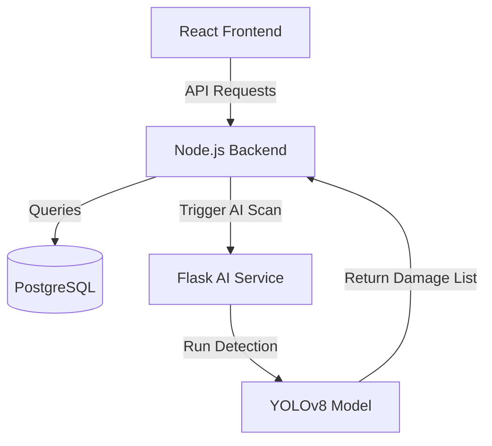

# 👥 FleetGuard AI — Group Work & Technical Summary

Use this document to explain each member's contributions, challenges, and solutions. 

---

## 📊 **1. Quick Summary Table**

### 💻 **Bethmi**
* **Primary Focus:** Admin Frontend, AI Service & Project Leadership

| Section | Details |
| :--- | :--- |
| **What I Did** | • Developed the **Manager Dashboard** (KPIs, Charts, Fleet Map Views). • Built the **Flask AI Microservice** (YOLOv8 damage detection). • Implemented client-side **PDF Generation** with Digital Signatures. • Set up overall Project Management templates/docs. |
| **Hardships (Challenges)** | • The AI service failed to start on macOS because Apple's AirPlay uses port 5000 by default. • Lack of trained weights on every machine stalled workflow testing for peers. |
| **How It Was Fixed** | • **Port Conflict:** Shifted the AI service default runner to **port 5001**. • **Model Stalling:** Built a fallback mock state called `STUB_MODE` so everyone could run the app freely without setup issues. |

---

### 🖥 **Yuraj**
* **Primary Focus:** Client Frontend & Feature Integration

| Section | Details |
| :--- | :--- |
| **What I Did** | • Built the **Driver Portal** (Dashboard, login, register, profile view). • Developed the **8-Step Inspection Form** UI with Camera capture grids. • Integrated **Multi-language support** (English, Sinhala, Tamil) with `i18next`. |
| **Hardships (Challenges)** | • Keeping images and form data safe across **8 distinct Pages** without losing data on navigation loops. • Signature canvas did not render fast enough if users downloaded report PDFs instantly. |
| **How It Was Fixed** | • **Data Flow:** Used React **Context API** (`InspectionContext`) to hold a secure, centralized shared state. • **PDF Speed:** Appended a simple **500ms delay wrapper** to ensure the canvas binds stably before capture. |

---

### ⚙️ **Chathura**
* **Primary Focus:** Client-Side Backend

| Section | Details |
| :--- | :--- |
| **What I Did** | • Designed the **PostgreSQL Database** & setup migrations. • Built the **Auth API** (Register, Login, Google OAuth, Reset flows). • Covered endpoints for **Inspections** submission and **Photos** streaming/saving. |
| **Hardships (Challenges)** | • The Manager Alert Counter counted finished inspections as new alerts on Dashboard load, creating a visual bug. |
| **How It Was Fixed** | • **Aggregation Error:** Updated the backend SQL Query rule to filter out already responded entries securely (`status = completed AND review IS NULL`). |

---

### 📐 **Kalindi**
* **Primary Focus:** Admin-Side Backend & Smart Ops

| Section | Details |
| :--- | :--- |
| **What I Did** | • Configured **Vehicles CRUD API** and analytics endpoints. • Created the **GPS Logging** trackers and map bindings. • Coded the **Smart Vehicle Assignment algorithm** (scoring metric). • Created the `npm run demo` seeder script for quick demo setup. |
| **Hardships (Challenges)** | • The Smart Assignment ranking returned absolute zero values if the vehicle logged no clean GPS logs prior to lookup. |
| **How It Was Fixed** | • **Query Crash:** Appended fallback metrics to query general availability if GPS weights were empty, preventing a crash. |

---

### 🧪 **Isuru (Iruwan)**
* **Primary Focus:** Testing & Quality Assurance (QA)

| Section | Details |
| :--- | :--- |
| **What I Did** | • Wrote the full back-end **Integration Test Suite** using `Jest`. • Executed absolute full-path **Manual QA reviews** on each user workflow. • Verified multi-language datasets across 500+ items. |
| **Hardships (Challenges)** | • Missing translation tags inside workflow guides was making labels look styled-out or empty on certain modes. |
| **How It Was Fixed** | • **Dictionary Bug:** Intercepted missing phrases during review cycles and manually appended matching keys directly into `si.json` and `ta.json`. |

---

## 🧠 **2. Deeper Technical Explanations (Talking Points)**

### 🌐 **The Tech Stack & Architecture Flow**
The system is built using a **Multi-Tier Architecture**:
1.  **Frontend (React 18)**: Deals with visual clicks, inputs, and canvas captures.
2.  **Backend (Node.js/Express)**: The traffic controller storing details to **PostgreSQL**.
3.  **AI Microservice (Python/Flask)**: Isolated strictly for running detection weights because Python is natively superior for Machine Learning workloads.

### 🔍 **Bethmi: AI Detections & PDF Tricks**
*   **What is YOLOv8?** It stands for *"You Only Look Once"*. It's a real-time objection detection algorithm that scans photos to find dents, bumps, or scratches.
*   **Why Client-side PDF?** Coding a PDF layout inside servers struggles with high CSS accuracy. By packing it on the client (`html2canvas`), the app hits a "Screenshot trigger" rendering styled digital cards identically to how it appeared in the browser.

### 🔍 **Yuraj: React State Cloud Management**
*   **What is Context API?** Ordinary React passes data down from step 1 to step 2 like a rigid pipeline. Context compiles the data inside a "Global Cloud" above the application, making Step 1 directly accessible inside Step 8 with no data wipes on page backings.

### 🔍 **Chathura: Role-Based Authorization**
*   **What is a JWT (JSON Web Token)?** When a User logs in, the server grants a secure Digital Badge containing their Role (Driver or Manager). For every page accessed, the backend inspects the token validating whether authorization parameters meet security clearance.

### 🔍 **Kalindi: Geographic Mathematics**
*   **What is the Smart Assignment Scoring Algorithm?**
    It doesn’t just guess. It tracks coordinates, applies the **Haversine Formula** (which measures spatial curves on a absolute spherical Earth grid), attaches damage weights from former inspectors, and yields a numerically accurate ranked output for managers.

### 🔍 **Isuru: Edge Defect Spotting**
*   **What are Integration Tests?**
    A testing robot hits API pathways simulated dozens of times per commit to make sure nothing crashes servers dynamically before users load the browser pages. It keeps continuous integrations error-free.
